# SPEC — Flaky Test Cleaner for `tikv/pd`

> 本规格文档定义一个 AI 驱动的“发现 → 分析 → 互动推进 → 修复 → Review 跟进 → 合入”的闭环系统，用于在 `tikv/pd` 仓库中自动识别并推动修复 flaky tests。

## 1. 背景与动机

`tikv/pd` 的 CI 偶发失败会造成：
- 合并节奏变慢（re-run / 重新排队）
- 信噪比下降（真实回归被噪音淹没）
- 排障成本升高（日志分散、线索不完整）

本项目通过周期性收集失败日志、判定 flaky、自动创建与维护 issue、参与讨论并在获得明确许可后自动提交修复 PR，来降低上述成本。

## 2. 目标 / 非目标

### 2.1 目标（Goals）
- 自动发现：周期性从 CI 拉取失败 run 的结构化证据。
- 自动归因：识别是否为 flaky，并给出“置信度 + 证据 + 可复现线索”。
- 自动治理：为每个 flaky 建立/维护可追踪的 issue（去重、聚合多次出现、打标签、状态推进）。
- 自动分析：在 issue 中提供根因推断、稳定性建议、最小修复策略与风险提示。
- 自动互动：当有人在 issue/PR 讨论时，提供基于证据的跟进与澄清。
- 自动修复（带闸门）：在满足“人类明确许可”的条件下自动创建修复分支与 PR，并根据 review 意见迭代直至合入或放弃。

### 2.2 非目标（Non-Goals）
- 不替代 maintainer 的最终判断：所有自动化都应可被审核、回滚、禁用。
- 不追求 100% 检测覆盖：优先高置信度、低误报。
- 不在本项目内实现 CI 平台本身的复杂解析器大全：优先支持 GitHub Actions，其他提供可插拔接口。

## 3. 术语与定义

- **CI Run**：一次 CI 执行（例如 GitHub Actions 的 workflow run）。
- **Failure Occurrence**：一次失败的具体发生（某 job/step/test case 失败）。
- **Flaky Test**：同一测试在相同/近似代码状态下不稳定（同 commit 或相近 commit，出现“失败/成功”交替或非确定性错误）。
- **Fingerprint（指纹）**：用于 dedup 的唯一键，描述“同一个 flaky 现象”。
- **Issue Thread**：用于治理该 flaky 的 GitHub Issue。

## 4. 总体架构

### 4.1 高层组件

1. **Scheduler**：周期触发（默认每 3 天；可配置为每周）。
2. **CI Provider**：抽象接口，默认实现 `GitHubActionsProvider`。
3. **LogFetcher**：抓取 run/job/step 日志（带缓存、重试、速率限制）。
4. **FailureExtractor**：从日志中抽取结构化失败片段（test 名称、失败类型、堆栈、平台信息等）。
5. **FlakyClassifier**：规则 + LLM 判定是否 flaky（输出置信度、证据与解释）。
6. **IssueManager**：创建/更新 issue、打标签、去重聚合、维护状态。
7. **IssueAgent**：统一承担“初次分析 + 后续互动回复”，共享同一上下文与证据存储。
8. **FixAgent**：在满足许可条件后生成修复 PR，并持续根据 review/讨论迭代直到合入或终止。
9. **RepoWorkspaceManager**：跨 agent 管理 `tikv/pd` 代码环境（克隆缓存、worktree、并发与清理）。
10. **StateStore**：保存指纹 → issue/PR 状态、历史 run 证据、动作审计。
11. **Observability**：日志、指标、告警、成本统计。

### 4.2 数据流（Discovery → Issue）

Scheduler → CI Provider 列举失败 runs → LogFetcher 拉取日志 → FailureExtractor 结构化 → FlakyClassifier 判定 → IssueManager 去重/创建/更新 → AnalysisAgent 评论。

### 4.3 数据流（Issue/PR → Interaction → Fix）

IssueAgent 监听互动 →（必要时）补充证据/解释/建议 → 当满足许可条件 → FixAgent 生成 PR 并迭代 → 合入后归档。

## 5. 外部系统与权限

### 5.1 GitHub 权限最小化

本系统需要的动作：
- 读取：workflow runs、日志（若公开仓库通常可匿名/低权限；私有需要 token）
- 写入：创建 issue、评论、打 label、创建 PR、推送分支、回复 review

建议拆分 token：
- `READ_TOKEN`：仅读 actions/logs
- `WRITE_ISSUE_TOKEN`：issue/comment/label
- `WRITE_CODE_TOKEN`：push 分支 + PR（仅在 Fix 阶段启用）

### 5.2 许可闸门（Human Gate）

**默认策略：系统永不自动写代码，除非满足以下“明确许可信号”之一：**
- Maintainer/committer 在对应 issue 打上 `ai-fix-approved` label
- 或在 issue/PR 评论包含精确短语（可配置）：`/ai-fix`（仅允许特定角色触发）

并且还必须满足：
- FlakyClassifier 置信度 ≥ 阈值（默认 0.75）
- 证据完整：至少 N 次失败 occurrence（默认 N=2）且包含可定位测试标识

若不满足：FixAgent 只允许给“建议 patch（diff 提议）”但不创建 PR（默认禁用，可配置）。

## 6. Flaky 判定策略

### 6.1 输入（Evidence Pack）
每个 Failure Occurrence 的结构化字段（尽量从日志提取）：
- `repo`, `workflow`, `run_id`, `run_url`, `commit_sha`, `branch`
- `job_name`, `runner_os`, `arch`, `rust/go version`（如可得）
- `test_framework`（go test / cargo test / etc）
- `test_name`（尽量提取完整包路径/用例名）
- `error_signature`（简化堆栈/错误消息 hash）
- `raw_excerpt`（受限长度，默认 200-400 行，带关键行优先）

### 6.2 规则层（Heuristics）
规则用于快速过滤：
- 明确“基础设施失败”应归为 `infra-flake`（网络、下载失败、runner 断联、权限/配额）。
- 明确“确定性编译错误/语法错误/缺失符号”不应归为 flaky（更像真实回归）。
- 对于“超时/数据竞争/随机性”类特征加权为 flaky。

### 6.3 LLM 层（LLM-based Classification）
LLM 任务：
- 给出分类：`flaky-test` / `infra-flake` / `likely-regression` / `unknown`
- 输出置信度 `0.0~1.0`
- 输出“证据引用”（指向 run_url + 关键 excerpt 片段 ID）
- 解释：为什么这样判定；还需要哪些信息才能更确定

### 6.4 合并策略
最终分类 = 规则先验 + LLM 判定（可配置权重）。
- 若分类为 `infra-flake`：直接忽略（不创建/更新 issue、不进入治理流程），仅计入指标与审计日志（可选）。
- 若规则强判定为 regression，则不创建 flaky issue，仅记录。
- 若 LLM=unknown 或低置信度，则创建 `needs-triage` issue（默认关闭；可配置为只记录不发 issue）。

## 6.5 已验证的 GitHub Actions 拉取步骤（tikv/pd）

> 目的：把“如何拉取哪部分内容”写成可直接实现的步骤，并验证 flaky 判断的最小可行数据来源。

已在 2026-01-21 通过 `gh api` 验证以下链路可用：

1) 列出 workflows（获取 workflow id）
- `GET /repos/tikv/pd/actions/workflows`

2) 针对某个 workflow，列出失败 runs
- `GET /repos/tikv/pd/actions/workflows/{workflow_id}/runs?status=failure&per_page=N`

3) 针对某次 run，列出 jobs（定位失败 job）
- `GET /repos/tikv/pd/actions/runs/{run_id}/jobs?per_page=N`

4) 拉取失败 job 的日志（可解析到 go test 失败标记）
- `GET /repos/tikv/pd/actions/jobs/{job_id}/logs`
- 实测该接口返回 `Content-Type: text/plain`（而非 zip），可直接按行解析。
- 在 `PD Test` 的失败 job 日志中可稳定抓到形如 `[FAIL]`、`--- FAIL:`、`panic:`、`timeout` 等信号。

最小可行判定（MVP）：
- 只针对 `PD Test` 类 workflow 的失败 job 做 FailureExtractor。
- FailureExtractor 使用正则提取：测试套件/用例名、失败段落（上下文窗口）、以及“可能 flaky”关键词（timeout、race、connection reset 等）。
- FlakyClassifier 使用“同一测试名 + 相近 commit 反复出现 + 错误签名相似”做初筛，再交给 LLM 输出置信度与解释。

## 7. Fingerprint 与去重

### 7.1 Fingerprint 目标
- 同一 flaky 现象应聚合到同一个 issue。
- 不同 flaky（不同测试或不同错误签名）应分开。

### 7.2 默认 Fingerprint 格式（v1）

`fingerprint_v1 = sha256(repo + test_name + normalized_error_signature + framework + optional_platform_bucket)`

- `normalized_error_signature`：对错误消息做归一化（去掉地址、行号、随机 ID、耗时等噪音），并截断到固定长度。
- `optional_platform_bucket`：仅在明显平台相关（windows/mac/linux）时加入。

### 7.3 去重流程
- 计算 fingerprint → 查询 StateStore
- 若已有 open issue：追加 occurrence、更新统计、必要时 bump 状态
- 若无 issue：创建新 issue

## 8. Issue 生命周期与状态机

### 8.1 Labels（建议默认）

> 约定：所有 labels 都带前缀 `flaky-test-cleaner/`，避免与仓库既有 label 冲突。

- `flaky-test-cleaner/flaky-test`：确认是 flaky test
- `flaky-test-cleaner/needs-triage`：低置信度，需要人工确认
- `flaky-test-cleaner/ai-managed`：该 issue 由本系统维护
- `flaky-test-cleaner/ai-fix-approved`：允许自动开 PR（许可闸门）
- `flaky-test-cleaner/fix-in-progress`：已开 PR 或正在尝试修复
- `flaky-test-cleaner/blocked`：等待外部信息（需要 maintainer 提供）

### 8.2 状态（StateStore）

- `DISCOVERED`：发现新 fingerprint（尚未写入或刚写入）
- `ISSUE_OPEN`：已创建或已关联到 issue
- `TRIAGED`：IssueAgent 已给出初次分析/复现/建议
- `WAITING_FOR_SIGNAL`：等待人工确认/许可/更多证据
- `NEEDS_UPDATE`：出现新 occurrence 或新证据，需要刷新 issue 总结（循环态）
- `APPROVED_TO_FIX`：收到明确许可（label/phrase）
- `PR_OPEN`：已创建 PR
- `PR_NEEDS_CHANGES`：收到 review request changes（循环态）
- `PR_UPDATING`：正在生成/推送修复提交（循环态）
- `MERGED`：合入
- `CLOSED_WONTFIX`：关闭/无法推进

### 8.3 触发条件（详细，含循环）

Mermaid 状态转换图（与本节文字保持一致）：

```mermaid
stateDiagram-v2
  [*] --> DISCOVERED: new fingerprint

  %% Discovery / issue creation
  DISCOVERED --> ISSUE_OPEN: IssueManager create/update issue
  ISSUE_OPEN --> TRIAGED: IssueAgent initial analysis comment
  TRIAGED --> WAITING_FOR_SIGNAL: wait for human signal

  %% Issue discussion loop
  WAITING_FOR_SIGNAL --> TRIAGED: new discussion / question
  WAITING_FOR_SIGNAL --> APPROVED_TO_FIX: label flaky-test-cleaner/ai-fix-approved or /ai-fix
  WAITING_FOR_SIGNAL --> CLOSED_WONTFIX: stale / maintainer asks stop

  %% Global: new occurrence arrives (loop)
  ISSUE_OPEN --> NEEDS_UPDATE: new CI occurrence
  TRIAGED --> NEEDS_UPDATE: new CI occurrence
  WAITING_FOR_SIGNAL --> NEEDS_UPDATE: new CI occurrence
  %% Note: after APPROVED_TO_FIX (and during PR loop), new occurrences are recorded but do not change state.

  NEEDS_UPDATE --> ISSUE_OPEN: IssueManager append occurrence

  %% PR loop
  APPROVED_TO_FIX --> PR_OPEN: FixAgent creates PR
  PR_OPEN --> PR_NEEDS_CHANGES: review requests changes
  PR_NEEDS_CHANGES --> PR_UPDATING: FixAgent prepares commits
  PR_UPDATING --> PR_OPEN: push commits; await review

  PR_OPEN --> MERGED: PR merged
  PR_OPEN --> CLOSED_WONTFIX: PR closed / stop

  MERGED --> [*]
  CLOSED_WONTFIX --> [*]
```

Discovery 循环：
- （`APPROVED_TO_FIX` 之前的状态）收到新 CI 失败 occurrence 且 fingerprint 相同 → `NEEDS_UPDATE`
- `NEEDS_UPDATE` → `ISSUE_OPEN`：IssueManager 成功把 occurrence 追加到 issue（或 state store）

修复阶段（`APPROVED_TO_FIX` 及之后）的约束：
- 新 CI occurrence 仍会写入 StateStore（用于统计与回归判断），但不会触发状态回退到 `NEEDS_UPDATE`。
- 如需在 PR/issue 上补充“仍然在失败”的信息，应由 FixAgent 作为备注评论发布，且不得改变主状态机流程。

Issue 循环：
- `DISCOVERED` → `ISSUE_OPEN`：IssueManager 完成 create/update issue 并打上 `flaky-test-cleaner/ai-managed`
- `ISSUE_OPEN` → `TRIAGED`：IssueAgent 发布首条分析评论（或更新“当前结论”段落）
- `TRIAGED` → `WAITING_FOR_SIGNAL`：默认进入等待
- `WAITING_FOR_SIGNAL` → `TRIAGED`：有新讨论/新提问，IssueAgent 回复并刷新结论（可多次循环）
- `WAITING_FOR_SIGNAL` → `APPROVED_TO_FIX`：出现允许信号（`flaky-test-cleaner/ai-fix-approved` 或 `/ai-fix`）

PR 循环：
- `APPROVED_TO_FIX` → `PR_OPEN`：FixAgent 创建 PR，并将 issue 打上 `flaky-test-cleaner/fix-in-progress`
- `PR_OPEN` → `PR_NEEDS_CHANGES`：收到 review request changes / blocking comment
- `PR_NEEDS_CHANGES` → `PR_UPDATING`：FixAgent 开始生成修复提交
- `PR_UPDATING` → `PR_OPEN`：提交推送成功，等待下一轮 review（循环）
- `PR_OPEN` → `MERGED`：PR merged
- `PR_OPEN` → `CLOSED_WONTFIX`：PR closed 且无继续空间（例如 maintainer 要求停止）

## 9. Agent 职责与输出规范

### 9.1 IssueCreatorAgent
输入：classification 结果 + evidence pack + fingerprint
输出：issue title/body（模板化），labels，去重行为（create/update）。

Issue 标题建议：
- `[flaky] <test_name> — <short error signature>`

Issue 正文生成规则（必须可重复、可幂等）：
- Issue body 由多个“机器维护区块”组成，每个区块用 HTML 注释包围，便于后续精确替换（避免重复堆叠）。
- 必须包含以下结构（Markdown）：
  1) `## Summary`：当前分类（仅 flaky-test/likely-regression/unknown 会进入 issue）、置信度、首次发现时间、最近一次出现时间
  2) `## Evidence`：最近 N 次 occurrence 表格（run_url、commit、test_name、error_signature）
  3) `## Log Excerpts`：每次 occurrence 提供 1-2 个 excerpt，使用折叠块 `
`，每个 excerpt 限制行数（默认 120 行）
  4) `## Automation`：fingerprint、state、上次扫描时间、系统版本（建议使用 `
` 折叠）

excerpt 选取策略（FailureExtractor → IssueCreatorAgent）：
- 优先匹配 go test 常见失败信号：`[FAIL]`, `--- FAIL:`, `panic:`, `DATA RACE`, `timeout`, `race`, `connection reset`, `broken pipe`
- 每个信号点提供固定上下文窗口（例如前后各 40 行），并在 excerpt 开头注明 `run_url` 与 `job_id`。

### 9.2 IssueAgent（合并 Analysis + Conversation，共享上下文）

输入：
- issue 当前内容（含历史结论）
- evidence pack（结构化失败 + excerpt）
- repo 上下文（源码、测试代码、最近变更；由 RepoWorkspaceManager 提供）

输出（两类行为）：
1) 初次分析（TRIAGED）：
- 可能根因（分层：最可能/次可能；每条必须绑定证据点）
- 如何复现（尽可能给命令/环境变量/建议 rerun 参数）
- 建议修复路径（最小变更优先，先测例稳定性）
- 风险/回归面提示
2) 互动回复（循环）：
- 对提问给出“证据链接 + 结论更新 + 下一步”
- 必须保持与 Summary 一致；如观点变化需说明“因为新增证据 X”。

是否需要 clone 仓库（默认策略）：
- 默认不做全量 clone：优先用 GitHub API 拉取相关文件内容（测试文件、失败栈涉及文件）以降低成本。
- 当需要跨文件搜索/定位测试定义/读取 build tag 等：使用 RepoWorkspaceManager 创建浅克隆环境（见 §9.4 与 §10.3）。

### 9.3 FixAgent（合并 Fix + ReviewResponse，带闸门）
输入：许可信号 + issue 上下文 + evidence + 目标修复策略
输出：
- 新分支（命名：`ai/flaky/<fingerprint-short>`）
- PR：描述、动机、测试计划、与 issue 关联
- 变更：优先修“测试稳定性”而非改产品逻辑；若必须改产品逻辑需更高门槛（默认禁用）。

Review 跟进（循环能力）：
- 读取 review comments / checks 失败摘要
- 生成最小提交（或解释性回复）并推送
- 若遇到“需要维护者决策”的分歧，停止自动推送，只在 PR 中给出选项与风险，不继续争论。

### 9.4 RepoWorkspaceManager（跨 Agent 的 repo 环境管理）

目标：让各个 agent 在“同一份代码上下文”上工作，同时控制磁盘与并发。

策略（建议默认）：
- 维护一个 bare mirror：`cache/tikv-pd.git`（定期 `git fetch --prune`）
- 每个 fingerprint/PR 使用 worktree：`worktrees/<fingerprint-short>/`，并 checkout 到对应 `head_sha`
- 并发限制：同一时刻最多 K 个 worktree（默认 K=2），超出则排队
- 清理：worktree 在 N 天无活动后回收（默认 7 天），但保留 mirror
- 读写隔离：IssueAgent 只读 worktree；FixAgent 使用独立 worktree + 分支

## 10. 存储与数据模型

### 10.1 StateStore（TiDB Cloud Starter）

存储必须使用 TiDB Cloud Starter（Serverless）。

创建与连接要点（基于 TiDB Cloud 官方文档）：
- 在 TiDB Cloud Console 创建 Starter cluster（约 30 秒完成）。
- 创建数据库密码；未设置密码无法连接。
- Starter/Essential 直连需要 TLS。
- 网络可选 public endpoint（从本机/CI 直连）或 private endpoint（生产推荐）。

连接形态：
- 使用 MySQL 协议直连（长期运行服务推荐）。
- 连接参数通过环境变量提供，严禁写入仓库：
  - `TIDB_HOST`, `TIDB_PORT`, `TIDB_USER`, `TIDB_PASSWORD`
  - `TIDB_DATABASE`（默认 `flaky_test_cleaner`）
  - `TIDB_CA_CERT_PATH`（TLS CA 证书路径）

说明：本项目在实现阶段需要提供“首次启动自动建库/建表”的迁移能力。

核心表（概念）：
- `occurrences`：run_id/job/test/error_signature/excerpt_id/timestamp
- `fingerprints`：fingerprint/status/issue_number/pr_number/last_seen/first_seen
- `issues`：issue_number/state/labels/history
- `audit_log`：每次自动动作（时间、动作、对象、结果、错误）
- `costs`：LLM token/调用次数

### 10.3 与 TiDB Cloud 的工程约束
- 必须使用连接池并设置合理超时，避免 serverless 下连接抖动导致资源耗尽。
- 所有写入操作保持幂等：以 `fingerprint` 作为唯一键（UNIQUE）。
- 对于长文本（日志 excerpt），建议存储为“摘要 + 外部链接 + 可选压缩文本”，避免行级膨胀。

### 10.2 数据保留
- 日志 excerpt 只保留必要片段，默认保留 90 天。
- 对外可引用的 run_url 永久保存。

## 11. 可观测性与运维

指标（Metrics）：
- `runs_scanned_total`, `failures_extracted_total`
- `flaky_detected_total`（按分类细分）
- `issues_created_total`, `issues_updated_total`
- `pr_created_total`, `pr_merged_total`
- `llm_tokens_total`, `llm_cost_estimate`
- `action_failures_total`（按原因：rate limit/auth/parse error）

日志（Logs）：
- 每个 fingerprint 的完整动作链路（含 run_url、issue/pr id）。

告警（Alerts）：
- 连续 N 次抓取失败
- GitHub rate limit 接近耗尽
- 自动写代码动作失败（需人工关注）

## 12. 失败处理与幂等

- 所有写操作都必须幂等：通过 fingerprint + issue_number 约束避免重复创建。
- 对 GitHub API：遵循 `Retry-After`，指数退避。
- 对 LLM：缓存分类结果（fingerprint + evidence hash），避免重复花费。
- 对日志抓取：本地缓存与 ETag（若支持）。

## 13. 安全与合规

- Secrets 仅通过 CI secrets / 环境变量注入，不落盘。
- 日志 excerpt 在写入 issue 前必须做敏感信息清洗（token、cookie、内部 URL）。
- 提供“紧急停止开关”（配置项）：禁用写操作、禁用 PR。

## 14. 测试策略

- 单元测试：
  - Fingerprint 归一化与稳定性
  - FailureExtractor 的样例日志解析
  - 去重/状态机转移
- 集成测试（可选，使用 GitHub API mock）：
  - issue 创建/更新
  - label 管理

## 15. 里程碑（建议）

### Milestone A — Discover + Issue (MVP)
- 支持 GitHub Actions 拉取失败 runs
- 提取关键失败片段
- 判定与创建/更新 issue（去重）

### Milestone B — Analysis + Interaction
- IssueAgent 输出高质量分析并基于事件增量回应（共享上下文）

### Milestone C — Fix + PR (gated)
- 实现许可闸门
- 自动开 PR 与最小修复

### Milestone D — Review Loop + Merge
- FixAgent 跟进意见
- 合入后自动归档与总结

## 16. 默认决策（可在实现前调整）

- CI Provider：GitHub Actions
- 调度：每 3 天一次（可配每周）
- 存储：TiDB Cloud Starter
- LLM 判定阈值：0.75
- 自动修复：默认关闭；仅在 `flaky-test-cleaner/ai-fix-approved` 或 `/ai-fix` 触发后开启
- 误报控制：低置信度默认不创建 issue（只记录），可配置为创建 `needs-triage`

---

## Appendix A — Issue 模板（草案）

标题：`[flaky] <test_name> — <short signature>`

正文（要点）：
- Summary（AI 判定 + 置信度）
- Evidence（最近 N 次 run 链接 + 关键 excerpt）
- Suspected root causes（分层）
- Suggested next steps（复现/修复）
- Automation notes（fingerprint、系统状态、下一次扫描时间；建议折叠显示）
